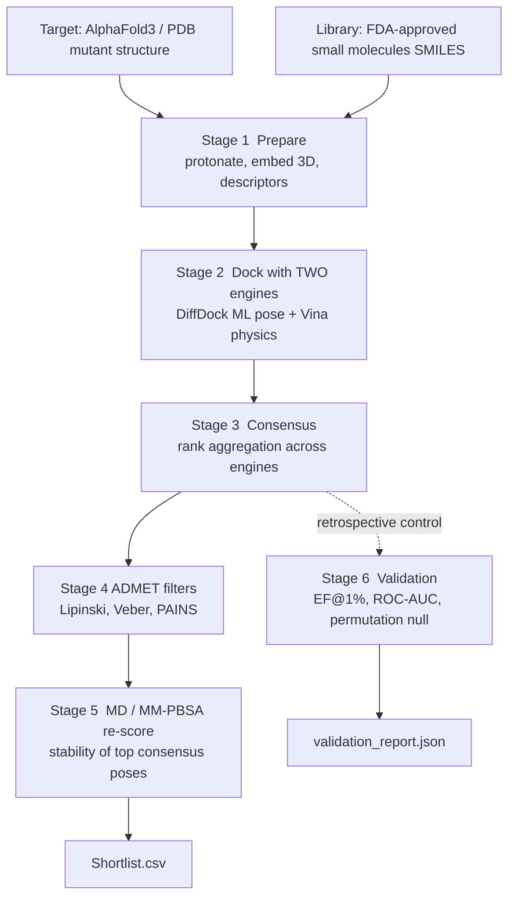

# Drug-Repurposing Pipeline (consensus + validation controls)

A reproducible scaffold for computational drug repurposing that narrows a library
of FDA-approved small molecules down to a defensible shortlist against a disease-
associated protein mutation. The design goal is rigor: the shortlist is not "the
compounds a single docking tool happened to like." Candidates must survive a
multi-stage funnel of independent methods, and the whole scoring approach is
checked against a retrospective control before anyone trusts it on true unknowns.

This repository runs end to end today in a self-contained **demo mode** (only
`numpy`, `pandas`, `scikit-learn`, `pyyaml` required). The heavy scientific
engines (AlphaFold3, DiffDock, AutoDock Vina, GROMACS, an ADMET predictor) plug
in behind adapter functions; demo mode substitutes deterministic synthetic scores
so the plumbing, the consensus logic, and the validation maths are all runnable
and testable on any machine.

## Architecture: the funnel



Plain-text view of the same funnel:

```
  hundreds of approved molecules
              |
   [1] prepare  (SMILES -> 3D, descriptors)
              |
   [2] dock     (DiffDock ML  +  AutoDock Vina physics)   two independent signals
              |
   [3] consensus (rank aggregation; neither tool decides alone)
              |
   [4] ADMET    (Lipinski Ro5, Veber, PAINS-like alerts)
              |
   [5] MD/MM-PBSA (re-score top poses for stability)
              |
        SHORTLIST  ->  results/shortlist.csv

   [6] validation runs in parallel on known actives vs decoys
       using the SAME consensus score  ->  results/validation_report.json
```

## How we avoid single-tool bias

A shortlist built from one tool's raw score is fragile: every docking program has
systematic blind spots. This pipeline hedges that in four ways.

1. **Consensus docking across complementary methods.** We combine a machine-
   learning pose predictor (DiffDock) with a physics-based scorer (AutoDock Vina).
   The two disagree in different ways, so agreement between them is more
   informative than either alone. Aggregation is done on ranks, not raw scores, so
   the two very different score scales (an ML confidence versus a kcal/mol energy)
   are combined fairly. We compute a weighted mean rank (a Borda-style consensus)
   and, in parallel, a weighted z-score consensus that preserves score magnitude.
   See `src/consensus.py`.

2. **Physics re-scoring of the top poses.** A pose that docks well but is unstable
   under dynamics is a false positive. The top consensus candidates are re-scored
   with a short molecular-dynamics run followed by an MM-PBSA free-energy estimate,
   which accounts for flexibility and solvation that rigid docking ignores. See
   `src/md.py`.

3. **Medicinal-chemistry filters.** Independent of any binding score, candidates
   are checked against Lipinski's rule of five, the Veber oral-bioavailability
   rules, and a lightweight PAINS-style alert set to remove likely assay artifacts
   and poor drug-like profiles. See `src/admet.py`.

4. **Retrospective validation with a null control.** This is the part that answers
   the reviewer's question "how do you know this is not just a favorable score?"
   Before trusting the funnel on unknowns, we run it on a labelled benchmark of
   known actives and decoys and measure whether our consensus score actually
   enriches for actives. The harness computes:
   - **Enrichment Factor** at the top 1% and 5% of the ranked list (`EF@1%`, `EF@5%`).
   - **ROC-AUC**, implemented exactly via the Mann-Whitney relationship with
     average-rank tie handling.
   - **A permutation / null control**: the labels are shuffled many times, the AUC
     is recomputed each time, and an empirical p-value reports how often a random
     labelling matches or beats the observed AUC. A shortlist whose enrichment is
     not distinguishable from this null does not get trusted.

   See `src/validate.py`. The maths is unit-tested (`tests/test_validate.py`): a
   perfect ranker scores AUC 1.0, a random ranker scores about 0.5, and the
   enrichment factor is checked against hand-computed toy cases.

## Quickstart

```bash
pip install -r requirements.txt
python main.py --demo
```

That runs the full funnel on the bundled demo data and prints a clean per-stage
report. It writes two artifacts:

- `results/shortlist.csv` : the ranked candidate shortlist after ADMET filtering,
  with every per-tool score, the consensus rank, the MM-PBSA delta for re-scored
  poses, the molecular descriptors, and the ADMET pass/fail reasons.
- `results/validation_report.json` : the retrospective validation metrics
  (EF@1%, EF@5%, ROC-AUC, and the permutation-null p-value).

The run is deterministic. Change the seed with `--seed N`; all randomness (the
synthetic engine scores and the permutation control) is seeded, so the same seed
reproduces the same shortlist and report byte for byte.

Run the tests:

```bash
pytest -q
```

## Real-run mode

Demo mode exists so the methodology is runnable without a GPU or a docking box.
For a real screen, provide a real target structure and wire in the engines. Each
heavy tool is optional and lives behind a single adapter function:

| Stage | Tool (optional) | Adapter |
|-------|-----------------|---------|
| Structure | AlphaFold3 or an experimental PDB/CIF | `data/target_meta.yaml` (structure + binding-site) |
| Descriptors | RDKit | `src/prepare.py` (`compute_descriptors`, used automatically if importable) |
| ML docking | DiffDock | `src/dock.py` (`diffdock_dock`, real path guarded by `demo=False`) |
| Physics docking | AutoDock Vina | `src/dock.py` (`vina_dock`) |
| MD re-scoring | GROMACS + gmx_MMPBSA | `src/md.py` (`mmpbsa_rescore`) |
| PAINS | RDKit FilterCatalog | `src/admet.py` (replace the heuristic alert set) |

To run against real engines, install the tools you need, point
`data/target_meta.yaml` at your prepared receptor and binding site, and invoke the
adapters with `demo=False` (or `python main.py --real`). The adapters raise a clear
error if a required binary is missing rather than silently faking a number.

### Optional heavy dependencies (not in `requirements.txt`)

- `rdkit` (exact descriptors and a real PAINS catalog)
- AutoDock Vina (`vina` binary)
- DiffDock (inference environment + weights)
- GROMACS (`gmx`) and `gmx_MMPBSA`
- an ADMET predictor of your choice

## Honesty and scope

- This is a **methodology scaffold with pluggable engine adapters**, not a trained
  or benchmarked predictor. Demo-mode scores are synthetic and deterministic; they
  exist to exercise the pipeline, not to predict binding.
- The numbers printed by `python main.py --demo` are illustrative of what the
  harness computes on the bundled demo set. They are not a benchmark result and
  should not be quoted as one. The bundled demo decoys are simple molecules; a
  defensible benchmark uses property-matched decoys (for example DUD-E or DEKOIS),
  which drop into `data/demo_decoys.smi` unchanged.
- The validation maths (EF, ROC-AUC, permutation control) is real and unit-tested;
  that is the reusable core, independent of any single docking engine.

## Repository layout

```
.
|- main.py                 end-to-end CLI orchestrator (argparse)
|- config.yaml             target id, consensus weights, ADMET thresholds, seed
|- requirements.txt        lightweight demo dependencies only
|- src/
|  |- prepare.py           SMILES -> descriptors (RDKit + documented fallback)
|  |- dock.py              DiffDock + Vina adapters (real + demo paths)
|  |- consensus.py         rank aggregation (mean rank / Borda + z-consensus)
|  |- md.py                GROMACS / MM-PBSA re-scoring adapter
|  |- admet.py             Lipinski Ro5, Veber, PAINS-like filters
|  |- validate.py          EF, ROC-AUC, permutation null control
|- data/
|  |- demo_actives.smi     approved-drug SMILES (demo actives)
|  |- demo_decoys.smi      simple-molecule SMILES (demo decoys)
|  |- target_meta.yaml     placeholder target + structure adapter point
|- tests/
|  |- test_validate.py     correctness tests for the validation + consensus maths
|- results/                generated outputs (gitignored)
```

## License

MIT. See `LICENSE`.
